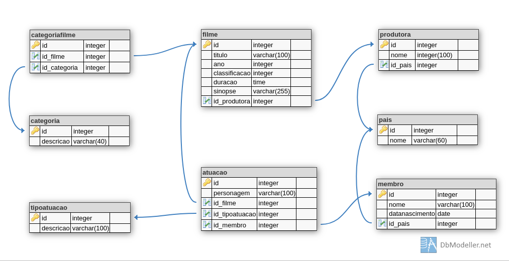

# Visão geral do projeto a ser modelado

Vamos modelar um sistema para gerenciamento de filmes. O sistema deve permitir o cadastro de filmes, com os seguintes dados:

* Título
* Diretor
* Ano de lançamento
* Gênero
* Duração
* Sinopse
* Atores
* País de origem
* Idioma original
* Produtora

A imagem abaixo mostra o diagrama de entidade e relacionamento do sistema:

[&lt; Início](. "Início")
 
[Primeira migração e criação do admin &gt;](primeira-migracao "Próximo")  